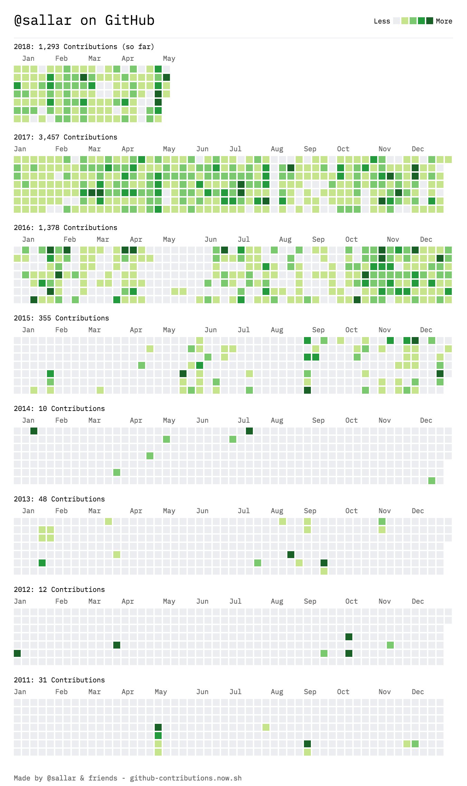

# flutter_heatmap_grid

[](https://pub.dev/packages/flutter_heatmap_grid)
[](https://opensource.org/licenses/MIT)

Flutter 网格热力图组件 - 以网格形式展示数据，通过颜色深浅直观地表示数值大小。



## 特性

- 🎨 **多种预定义颜色方案** - 热力图、灰度、GitHub 风格等
- 📊 **两种数据模式** - 传统二维数组和日期热力图
- 🗓️ **GitHub 贡献图风格** - 类似 GitHub 活动日历的日期热力图
- 🏷️ **行列标签** - 支持自定义标签和位置
- 🖱️ **交互支持** - 点击、长按、悬停事件
- 📜 **图例显示** - 渐变或离散样式，支持四个方向
- 🔄 **水平滚动** - 适合长日期范围的数据
- 🎯 **高度可定制** - 单元格大小、间距、圆角等

## 安装

在 `pubspec.yaml` 中添加依赖：

```yaml
dependencies:
  flutter_heatmap_grid: ^0.0.1
```

然后运行：

```bash
flutter pub get
```

## 快速开始

### 传统二维数组模式

```dart
import 'package:flutter_heatmap_grid/flutter_heatmap_grid.dart';

HeatmapGrid(
  data: GridData(
    values: [
      [10, 20, 30, 40],
      [50, 60, 70, 80],
      [90, 100, 110, 120],
    ],
    rowLabels: ['A', 'B', 'C'],
    columnLabels: ['Q1', 'Q2', 'Q3', 'Q4'],
  ),
  colorMapping: ColorMapping.heat(),
  showValues: true,
)
```

### 日期热力图模式（GitHub 风格）

```dart
// 准备数据
final now = DateTime.now();
final startDate = DateTime(now.year - 1, now.month, now.day);
final dateData = List.generate(365, (i) {
  final random = Random();
  return DateHeatmapCell(
    date: startDate.add(Duration(days: i)),
    value: random.nextDouble() * 100,
  );
});

// 使用 GitHub 风格构造函数
HeatmapGrid.githubStyle(
  dateData: dateData,
  showMonthLabels: true,
  scrollable: true,
)
```

## 颜色方案

### 预定义方案

```dart
// 热力图：蓝 → 青 → 绿 → 黄 → 红
ColorMapping.heat()

// 灰度：黑 → 白
ColorMapping.grayscale()

// GitHub 绿色（5级离散）
ColorMapping.github()

// GitHub 蓝色（5级离散）
ColorMapping.githubBlue()
```

### 自定义颜色

```dart
ColorMapping.custom(
  colors: [
    Color(0xFFE3F2FD),  // 浅蓝
    Color(0xFF2196F3),  // 蓝色
    Color(0xFF0D47A1),  // 深蓝
  ],
)
```

### 反转颜色

```dart
ColorMapping.heat(reverse: true)  // 红 → 黄 → 绿 → 青 → 蓝
```

## 组件属性

### 通用属性

| 属性 | 类型 | 默认值 | 说明 |
|------|------|--------|------|
| `colorMapping` | `ColorMapping` | `heat()` | 颜色映射配置 |
| `cellSize` | `double` | `40.0` | 单元格大小 |
| `cellSpacing` | `double` | `2.0` | 单元格间距 |
| `cellRadius` | `double` | `4.0` | 单元格圆角 |
| `showValues` | `bool` | `false` | 是否显示数值 |
| `valueFormatter` | `Function` | - | 数值格式化函数 |
| `showLegend` | `bool` | `true` | 是否显示图例 |
| `legendPosition` | `LegendPosition` | `right` | 图例位置 |
| `legendStyle` | `LegendStyle` | `gradient` | 图例样式 |
| `onCellTap` | `Function` | - | 单元格点击回调 |
| `tooltipBuilder` | `Function` | - | 提示文本构建器 |

### 日期模式属性

| 属性 | 类型 | 默认值 | 说明 |
|------|------|--------|------|
| `dateData` | `List<DateHeatmapCell>` | - | 日期数据列表 |
| `startDate` | `DateTime` | - | 起始日期 |
| `endDate` | `DateTime` | - | 结束日期 |
| `firstDayOfWeek` | `int` | `1` | 一周第一天（1=周一，7=周日） |
| `showMonthLabels` | `bool` | `false` | 是否显示月份标签 |
| `scrollable` | `bool` | `false` | 是否支持水平滚动 |

## 示例

### 完整示例

```dart
import 'package:flutter/material.dart';
import 'package:flutter_heatmap_grid/flutter_heatmap_grid.dart';
import 'dart:math';

void main() {
  runApp(const MyApp());
}

class MyApp extends StatelessWidget {
  const MyApp({super.key});

  @override
  Widget build(BuildContext context) {
    // 生成过去一年的随机数据
    final now = DateTime.now();
    final startDate = DateTime(now.year - 1, now.month, now.day);
    final random = Random();

    final dateData = List.generate(365, (i) {
      return DateHeatmapCell(
        date: startDate.add(Duration(days: i)),
        value: random.nextInt(10).toDouble(),
      );
    });

    return MaterialApp(
      home: Scaffold(
        appBar: AppBar(title: const Text('Heatmap Grid Demo')),
        body: SingleChildScrollView(
          child: Column(
            children: [
              // GitHub 风格日期热力图
              const Padding(
                padding: EdgeInsets.all(16.0),
                child: Text('GitHub Style Date Heatmap'),
              ),
              HeatmapGrid.githubStyle(
                dateData: dateData,
                showMonthLabels: true,
                scrollable: true,
                onCellTap: (cell) {
                  final date = cell.data as DateTime;
                  print('Tapped: $date, Value: ${cell.value}');
                },
                tooltipBuilder: (cell) {
                  final date = cell.data as DateTime;
                  return '${date.year}-${date.month.toString().padLeft(2, '0')}-${date.day.toString().padLeft(2, '0')}\nValue: ${cell.value.toInt()}';
                },
              ),

              const SizedBox(height: 32),

              // 传统热力图
              const Padding(
                padding: EdgeInsets.all(16.0),
                child: Text('Traditional Heatmap'),
              ),
              HeatmapGrid(
                data: GridData.sample(rows: 8, cols: 12),
                colorMapping: ColorMapping.heat(),
                cellSize: 30,
                showValues: true,
                valueFormatter: (v) => v.toStringAsFixed(0),
                showLegend: true,
                legendPosition: LegendPosition.bottom,
              ),
            ],
          ),
        ),
      ),
    );
  }
}
```

### 自定义月份和星期标签

```dart
HeatmapGrid.githubStyle(
  dateData: dateData,
  showMonthLabels: true,
  monthNameBuilder: (month) => [
    'Jan', 'Feb', 'Mar', 'Apr', 'May', 'Jun',
    'Jul', 'Aug', 'Sep', 'Oct', 'Nov', 'Dec'
  ][month - 1],
  rowLabelStyle: TextStyle(fontSize: 8),
)
```

## API 参考

### HeatmapGrid

主组件，支持两种构造函数：
- `HeatmapGrid()` - 默认构造，适合传统二维数据
- `HeatmapGrid.githubStyle()` - GitHub 风格预设，适合日期热力图

### GridData

传统网格数据模型。

```dart
GridData({
  required List<List<double>> values,
  List<String>? rowLabels,
  List<String>? columnLabels,
})

// 创建示例数据
GridData.sample({rows: 10, cols: 10, minVal: 0, maxVal: 100})
```

### DateHeatmapCell

日期热力图单元格数据。

```dart
DateHeatmapCell({
  required DateTime date,
  required double value,
  Color? customColor,  // 可选，覆盖自动计算的颜色
  dynamic data,         // 可选，附加数据
})
```

### ColorMapping

颜色映射配置。

```dart
ColorMapping.heat({minValue, maxValue, reverse})
ColorMapping.grayscale({minValue, maxValue, reverse})
ColorMapping.github({minValue, maxValue, reverse})
ColorMapping.githubBlue({minValue, maxValue, reverse})
ColorMapping.custom({required colors, minValue, maxValue, reverse})
```

## 平台支持

| 平台 | 支持 |
|------|------|
| Android | ✅ |
| iOS | ✅ |
| Web | ✅ |

## 许可证

MIT License

## 贡献

欢迎提交 Issue 和 Pull Request！

## 仓库

[https://github.com/moming2008/flutter_heatmap_grid](https://github.com/moming2008/flutter_heatmap_grid)
